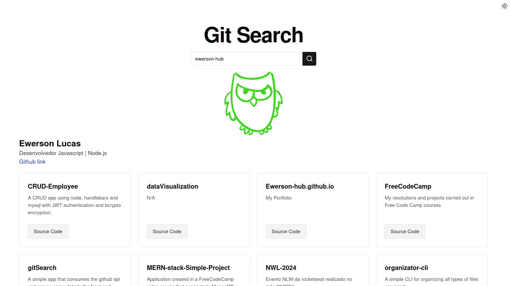
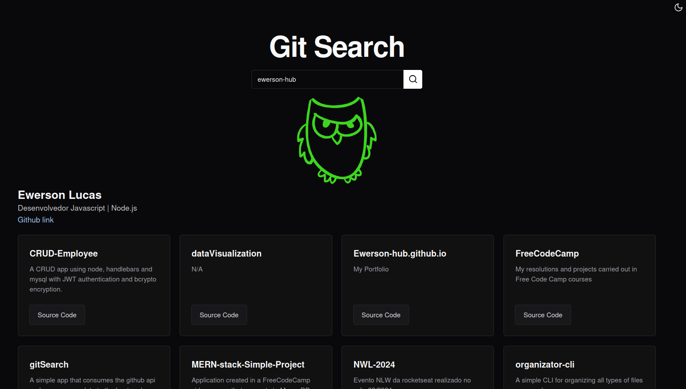

## Gir Search Project

>The project consists of creating a Node.js application that consumes a Github API through a parameter (git username) and serves the front-end in React some public user data such as name, biography, profile photo and repositories .

#### App Image 

